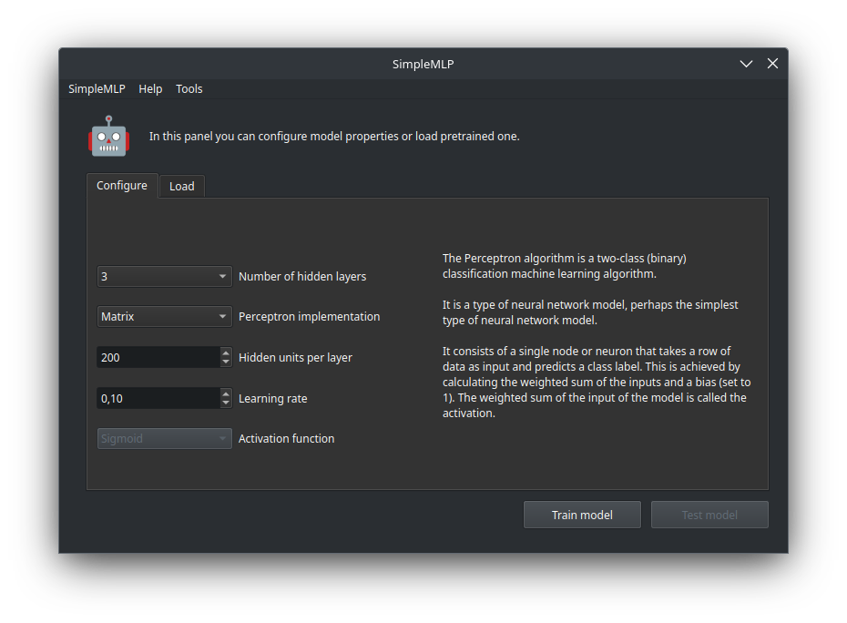
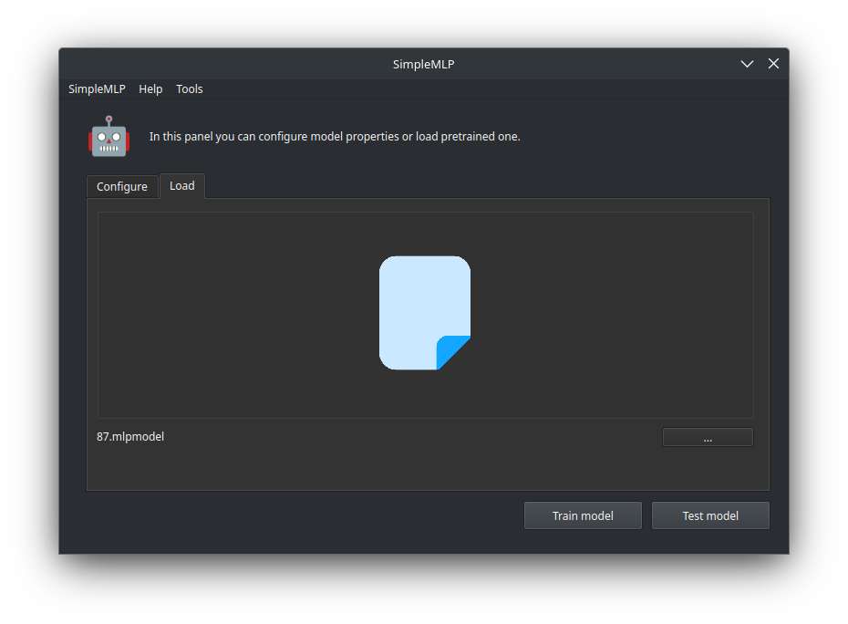
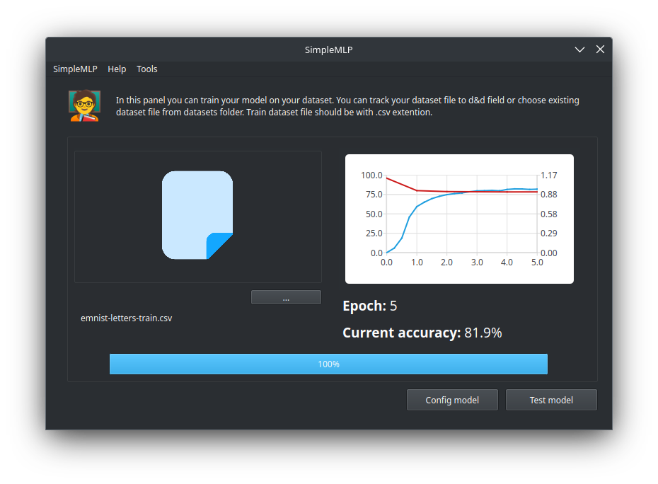
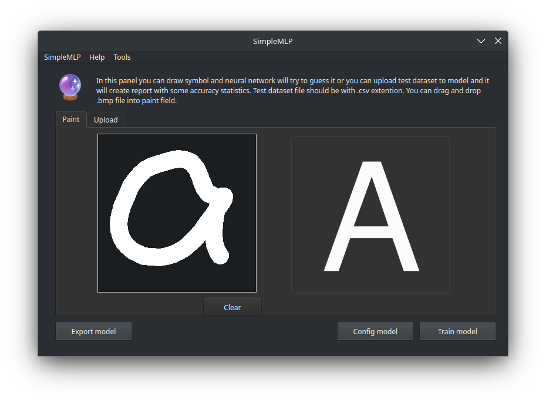
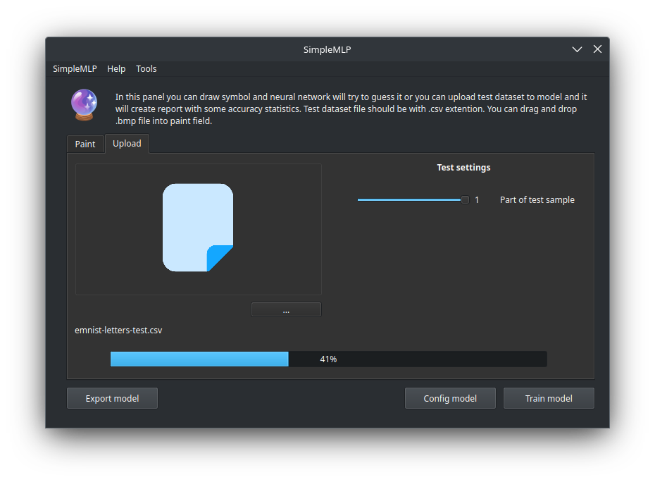

<h1> 
   
 
      Multi Layer Perceptron
        
   

</h1>

   Implementation of a basic multilayer perceptron using C++ without any external libraries.
    
 framework is used for GUI, project is written according to MVC design pattern.

<h2>Features 🤯</h2>
<ul>
   <li>Configure model properties for training such as:
      <ul>
         <li>Perceptron implementation type
            <ul>
               <li>Matrix
               <li>Graph
            </ul>
         <li>Number of hidden layers
         <li>Number of neurons (units) per hidden layer
         <li>Learning rate
         <li>Activation Function
            <ul>
               <li>Sigmoid
               <li>Leaky ReLU
               <li>Linear
               <li>Bipolar Sigmoid
            </ul>
      </ul>
      
   <li>Import pretrained model
      
   <li>Learning on given training dataset using cross-validation
      
   <li>Testing trained model with built-in drawing field or by importing pre-drawn image 
      
   <li>Testing trained model on testing dataset 
      
</ul>
<h2>Installation ⚙️</h2>
<pre>
   <code>
   make install
   </code>
</pre>
 
And that's it! Compiled application will be located in the <i>bin</i> directory. 

On MacOS it will also be located in Launchpad for ease of use. 

On Windows... Well, we are working on it! 

<h2>Requirements ☑️</h2>
<ul>
   <li>  C++17
   <li>  Qt6.5.0
</ul>
<h2>TODO 👨‍💻</h2>
<ul>
   <li> Support any dataset by using mapping
   <li> Change pen's color for different datasets 
   <li> Create both portable and installable version of application for Windows 
</ul>
<h2>Acknowledgements 🙇</h2>
<ul>
   <li> <a href="https://youtu.be/bW4dKxtUFpg">Dmitriy Korobchenko</a> for video explaining maths behind back propagation algorithm
</ul>
